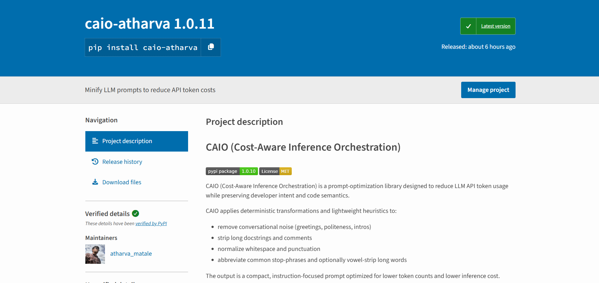

# CAIO (Cost-Aware Inference Orchestration)
[](https://badge.fury.io/py/caio-atharva)
[](https://opensource.org/licenses/MIT)

[](https://pypi.org/project/caio-atharva/)

**CAIO** is a high-performance optimization engine designed to drastically reduce LLM API costs. It employs a deterministic, multi-stage minification strategy that intelligently scrubs conversational noise ("fluff"), abbreviates natural language, and compresses code-centric prompts before transmission, ensuring you only pay for the tokens that matter.

---

## Key Features

- **Sentence-Level NLP Scrubber**: Intelligently identifies and removes non-essential conversational text (greetings, politeness, intros) via regex categories, while preserving core logic and code context.
- **Code Minifier**: Strips docstrings, inline comments, and formatting overhead to maximize token density.
- **Abbreviation & Compression Engine**: Substitutes common words (`please` → `pls`, `thanks` → `thx`) and applies conservative vowel stripping for long natural-language words (`friends` → `frnds`).
- **Stopword Pruning**: Removes low-information tokens and applies a final proportional trim if needed.
- **Quantified Savings**: Prints token estimates, percentage saved, and estimated dollar savings based on configurable cost rates (defaults: $10/1M input tokens, $25/1M output tokens).
- **Cost-Efficient**: Directly reduces the token count sent to providers like OpenAI, Google Gemini, and Anthropic.

---

## Installation

Install the package via pip:

```bash
pip install caio-atharva
```
---

## Usage Example

Import `CAIO`, initialize it with your target model, and start optimizing your prompts immediately.

```python
from caio import CAIO

# Initialize the optimizer. Specify your target model (default: gemini-1.5-flash)
optimizer = CAIO(model="provider-5/gemini-3-pro")

# Your original, verbose prompt
bloated_prompt = """
Hello there! I hope you are having a great day.
I'm new to Python and I was wondering if you could please help me.
Could you write a function to calculate the fibonacci sequence?
Make sure it's recursive. Thanks so much!
"""

# Optimize the prompt
result = optimizer.optimize(bloated_prompt)

# Access and print the results
print(f"Original Length: {len(bloated_prompt)}")
print(f"Optimized Prompt: {result['optimized_prompt']}")
print(f"Tokens/Chars Saved: {result['tokens_saved']}")
```

### Output

The optimized prompt sent to the LLM will look like this:

```text
write a function to calculate the fibonacci sequence? Make sure it's recursive.
```

---

## Algorithm Summary

These steps are deterministic and fast; they prioritize keeping code tokens intact.

| Step | Description |
| :--- | :--- |
| **Noise Removal** | Sentence-level scrubbing via regex categories (greetings, politeness, intros) |
| **Docstring & Comment Stripping** | Removes inline comments and docstrings from code blocks |
| **Abbreviation Substitution** | `please` → `pls`, `thanks` → `thx`, and more |
| **Vowel Stripping** | Conservative stripping for long natural-language words (`friends` → `frnds`) |
| **Stopword Pruning** | Removes low-information tokens with a final proportional trim |

---

## Impact Comparison

See how CAIO transforms a standard prompt into a cost-efficient payload.

| Feature | Bloated Prompt (Expensive) | CAIO Optimized Prompt (Efficient) |
| :--- | :--- | :--- |
| **Content** | *"Hi! Please write a Python script for binary search. Thanks!"* | `write a Python script for binary search.` |
| **Token Load** | **High** (Includes social overhead) | **Low** (Pure instruction & code) |
| **Cost** | **$$$** (paying for "Please" and "Thanks") | **$** (paying only for logic) |
| **Latency** | Slower processing of extra text | Faster inference |

---

If you want to integrate CAIO into your application, see `main_example.py` for a minimal pattern to import the library and optimize prompts before sending them to your LLM provider.

---

## Metadata

- **Developer**: [Atharva Matale](https://www.linkedin.com/in/atharvamatale/)
- **License**: MIT License
- **Version**: 1.0.11

---

*Maximize efficient inference. Minimize costs. Use CAIO.*
